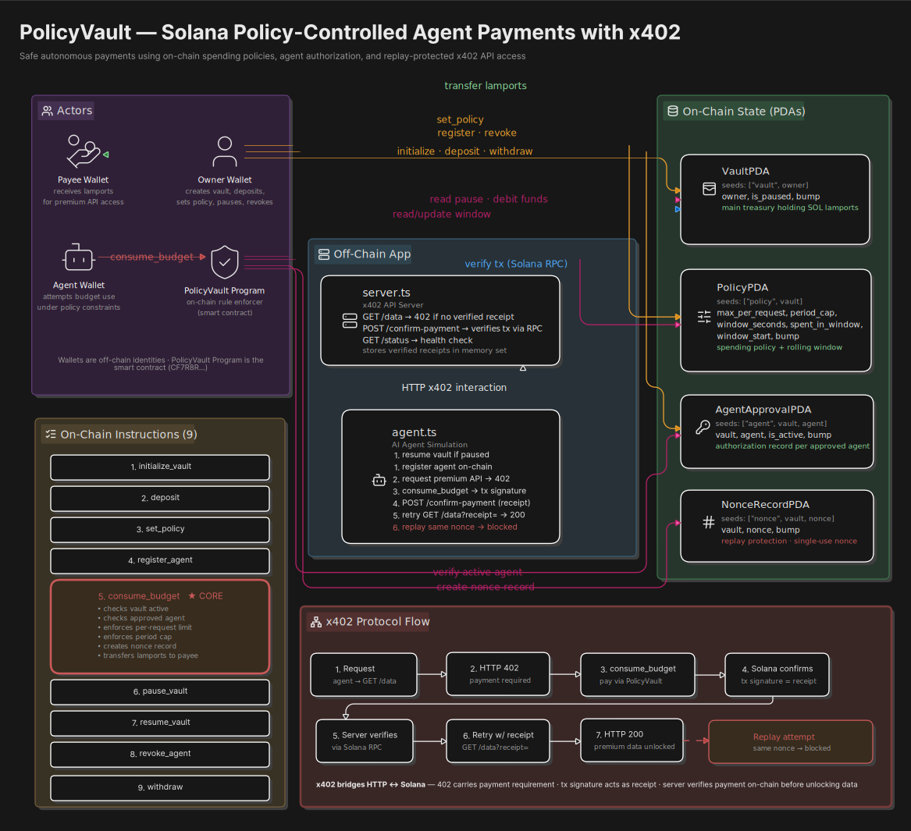

# PolicyVault

## Dashboard [Live link](https://policy-vault-opal.vercel.app/) to Test

**On-chain spending policies for AI agents on Solana.**

PolicyVault enforces programmable spending rules so AI agents can pay APIs autonomously via the [x402 protocol](https://www.x402.org) (HTTP 402 Payment Required) — without ever draining your wallet. Every spend is policy-checked, replay-protected, and on-chain verifiable.

Built with Anchor + Solana for the **Solana Fellowship Capstone 2026**.

---

## Architecture

<!-- Replace with your architecture diagram -->
<!-- Suggested path: assets/policyvault-architecture.png -->


### On-chain Program

| Account | Seeds | Purpose |
|---|---|---|
| **Vault** | `["vault", owner]` | One per owner. Tracks owner and pause state. |
| **Policy** | `["policy", vault]` | Spending limits: max/request, period cap, rolling window. |
| **AgentApproval** | `["agent", vault, agent]` | Whitelist of authorized agent wallets. |
| **NonceRecord** | `["nonce", vault, nonce]` | Replay protection — one per spend. |

### Instructions

| Instruction | Signer | Description |
|---|---|---|
| `initialize_vault` | Owner | Creates the Vault PDA. |
| `deposit` | Owner | Transfers SOL from owner into vault. |
| `set_policy` | Owner | Creates/updates spending policy. |
| `register_agent` | Owner | Whitelists an agent wallet. |
| `revoke_agent` | Owner | Revokes an agent. |
| `consume_budget` | Agent | The core — checks policy, transfers SOL, burns nonce. |
| `pause_vault` | Owner | Emergency pause. |
| `resume_vault` | Owner | Resume spending. |
| `withdraw` | Owner | Withdraw SOL from vault. |


---

## Project Structure

```
policy-vault/
├── programs/
│   └── policy-vault/          # Anchor program (Rust)
│       └── src/
│           ├── lib.rs         # Entry point, 9 instruction dispatchers
│           ├── state.rs       # 4 account structs + 4 events
│           ├── errors.rs      # 8 custom error codes
│           └── instructions/  # One file per instruction
├── app/
│   ├── server.ts              # x402 verification server (deployed on Render)
│   ├── index.html  # Phantom-powered UI dashboard
│   ├── agent.ts               # CLI agent simulator (local dev)
│   └── setup-devnet.ts        # Devnet setup script (local dev)
├── tests/
│   └── policy-vault.ts        # 11 integration tests
├── migrations/
│   └── deploy.ts              # Anchor migration placeholder
├── Anchor.toml                # Anchor configuration
├── Cargo.toml                 # Rust workspace root
├── package.json               # Node dependencies
└── tsconfig.json              # Root TypeScript config
```

---

## Prerequisites

- [Rust](https://rustup.rs/) (1.89.0, set via `rust-toolchain.toml`)
- [Solana CLI](https://docs.solana.com/cli/install-solana-cli-tools) (v2.x)
- [Anchor CLI](https://www.anchor-lang.com/docs/installation) (0.32.1)
- [Node.js](https://nodejs.org/) (v24+)
- [Yarn](https://yarnpkg.com/) or npm
- [Phantom Wallet](https://phantom.app/) browser extension (for UI)

---

## Localnet Testing

### 1. Start local validator

```bash
solana-test-validator --enable-rpc-transaction-history --reset
```

### 2. Install dependencies

```bash
npm install
```

### 3. Build & deploy program locally

```bash
anchor build
anchor deploy --provider.cluster localnet
```

### 4. Run integration tests

```bash
anchor test --skip-local-validator
```

This runs 11 tests covering:
- Vault initialization
- Deposit
- Set policy
- Agent registration
- consume_budget (happy path)
- Replay protection (same nonce rejected)
- Exceeds per-request limit
- Unauthorized wallet
- Vault paused rejection
- Agent revocation
- Withdrawal

### 5. Start x402 server locally

```bash
npx ts-node app/server.ts
# or after build:
npm start
```

### 6. Run agent demo (optional)

In another terminal:

```bash
npx ts-node app/agent.ts
```

### 7. Open the dashboard

Open `app/index.html` in a browser, set network to **Localnet**, and connect Phantom (localnet mode uses simulation).

---

## Devnet Usage Flow

### 1. Deploy program to devnet

```bash
anchor build
anchor deploy --provider.cluster devnet
```

Fund your deploy wallet if needed:

```bash
solana airdrop 2 --url devnet
```

### 2. Deploy the x402 server

The server is at `app/server.ts`. Deploy to any Node.js host (Render, Railway, etc.):

**Render-specific:**
- **Build command:** `npm install && npm run build`
- **Start command:** `node app/server.js`
- **Environment variables:**

| Variable | Default | Description |
|---|---|---|
| `PORT` | `3000` | Server port (Render sets this automatically) |
| `RPC_URL` | `https://api.devnet.solana.com` | Solana RPC endpoint |
| `PROGRAM_ID` | `CF7R8RBEwGJtmDtxLkxsLJWWg8TdcQTiEVM34JtDxVLY` | PolicyVault program ID |
| `PRICE_SOL` | `0.005` | Cost per API request (SOL) |
| `ALLOWED_ORIGIN` | `*` | CORS origin |

### 3. Deploy the dashboard

The dashboard at `app/index.html` is a single static HTML file. Host it on:

- **Netlify** — drag and drop, or connect your GitHub repo
- **Vercel** — import project, output dir `app/`
- **GitHub Pages** — push to `docs/` or root

The dashboard connects to Phantom wallet and targets Solana devnet by default. Update the **Server URL** field to point to your deployed Render server.

### 4. End-to-end demo

1. Open the dashboard in a browser with Phantom installed
2. Click **Connect Phantom** (switch wallet to devnet)
3. Click **Initialize Vault** (Phantom signs — one-time)
4. Click **Deposit SOL** (fund the vault)
5. Click **Set Policy** (configure spending limits)
6. Enter or generate an agent pubkey, click **Register Agent**
7. Click **Run Full x402 Flow** — observe:
   - `GET /data` → 402 Payment Required
   - Agent funded with SOL for rent + fees
   - `consume_budget` → transaction confirmed, nonce burned
   - `POST /confirm-payment` → server verifies on-chain
   - `GET /data?receipt=...` → 200 + premium data

---

## Edge Cases

The dashboard includes pre-configured edge-case buttons:

| Button | Expected Behavior |
|---|---|
| **Exceed req cap** | Sets spend above policy limit → `ExceedsPerRequestLimit` |
| **Replay nonce** | Reuses a burned nonce → `NonceAlreadyUsed` |
| **Paused vault** | Pauses vault then attempts spend → `VaultPaused` |
| **Revoked agent** | Revokes agent then attempts spend → `AgentRevoked` |
| **Unauth wallet** | Spends from an unregistered wallet → constraint failure |

---

## API Reference

### `GET /status`

Returns server health and program info.

### `GET /data`

Returns **402 Payment Required** with payment metadata if no valid receipt is supplied.

| Query Param | Description |
|---|---|
| `receipt` | Transaction signature from a verified `consume_budget` call |

### `POST /confirm-payment`

Verifies a transaction signature on-chain and stores a receipt.

**Request body:**

```json
{
  "txSignature": "string (base58)",
  "vaultPda": "string (base58)",
  "owner": "string (base58)",
  "agent": "string (base58)",
  "payee": "string (base58)",
  "expectedLamports": "number"
}
```

**Validation:**
- Transaction exists and succeeded
- Transaction called the PolicyVault program
- Vault PDA is in the transaction accounts
- Payee is in the transaction accounts
- Vault lost `≥ expectedLamports`
- Payee gained `≥ expectedLamports`

---

## Environment Variables

### Server (`app/server.ts`)

| Variable | Default | Description |
|---|---|---|
| `PORT` | `3000` | HTTP server port |
| `RPC_URL` | `https://api.devnet.solana.com` | Solana RPC endpoint |
| `PROGRAM_ID` | `CF7R8RBEwGJtmDtxLkxsLJWWg8TdcQTiEVM34JtDxVLY` | Program to verify against |
| `PRICE_SOL` | `0.005` | Lamports required per request |
| `ALLOWED_ORIGIN` | `*` | CORS `Access-Control-Allow-Origin` |

### Dashboard (`index.html`)

All configurable via the UI control panel — no env vars needed.

---

## Technical Stack

- **Blockchain:** Solana (devnet)
- **Framework:** Anchor 0.32.1
- **Language:** Rust (program) + TypeScript (client/server)
- **Wallet:** Phantom (browser extension)
- **Server:** Node.js (http module, no framework)
- **Dashboard:** Vanilla HTML/CSS/JS (`@solana/web3.js` via CDN)
- **Hosting:** Render (server) + Netlify/Vercel (dashboard)

---

## Acknowledgements

Built for the **Solana Fellowship Capstone 2026**.

<!-- Replace with your name/link -->
Built by [Hussain Sharif](https://github.com/Hussain-Sharif)
